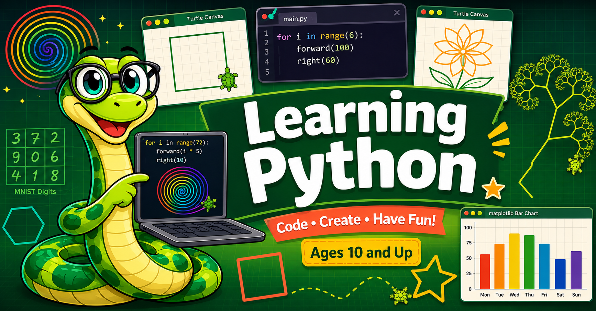

# Learning Python

!!! mascot-welcome "Welcome from Monty!"
    { class="mascot-admonition-img" }
    Hi! I'm Monty, your friendly python-snake guide. I'll be with you every step of the way
    as you learn to write real Python — right here in your browser, no installation needed.
    Let's go!

**Beginning Python — From Blocks to Code with Monty** is an interactive intelligent textbook
for students ages 10–13 who are ready to move from block-based programming (like Scratch)
into real, text-based Python. Every lesson includes live coding windows powered by
**Skulpt** — a Python engine that runs directly in your browser so you can read, run,
and modify code instantly on every page.

## Learning Python with Skulpt

The primary coding environment throughout this textbook is **Skulpt** — a JavaScript
implementation of Python that runs entirely in your browser. No account, no download,
no setup. Every chapter includes one or more inline Skulpt labs where you can:

1. **Read** a short, working Python program
2. **Run** it instantly by clicking the Run button
3. **Modify** it — change a number, a color, a direction — and run it again

Skulpt supports **turtle graphics** out of the box, giving students immediate visual
feedback as they draw shapes, spirals, flowers, and fractals. The drawing canvas
appears right below the code editor, so learners see their program's output the
moment they click Run.

Try it yourself right now — click **Run** to see the turtle draw a colorful hexagon,
then change the colors, the number of sides, or the distance and run it again:

  

    <textarea id="code" spellcheck="false">import turtle
t = turtle.Turtle()
colors = ["red", "orange", "yellow", "green", "blue", "purple"]
for i in range(6):
    t.pencolor(colors[i])
    t.forward(100)
    t.right(60)
</textarea>
    

      <button id="run-btn" onclick="runSkulpt()">&#9654; Run</button>
      <button id="reset-btn" onclick="resetSkulpt()">&#8635; Reset</button>
    

    <pre id="output"></pre>
  

  

    

  

That seven-line program draws a colorful hexagon — and changing `6` to `5` or `100` to `150`
takes one second and teaches more than a paragraph of explanation ever could.

## Learning Python with Jupyter Notebooks

[Jupyter Notebooks](https://jupyter.org/) are the preferred tool for data science
professionals and a great next step after this textbook. They support turtle graphics
(opening a separate drawing window) and give students access to tens of thousands of
community-written example notebooks. Jupyter is ideal for students moving into data
visualization, NumPy, and machine learning.

## Learning Python with Raspberry Pi

The [Raspberry Pi Foundation](https://www.raspberrypi.org/documentation/usage/python/)
chose Python as the primary language for physical computing on the Pi. If you have a
Raspberry Pi, Python runs natively on it and all the standard libraries — turtle,
matplotlib, and even Keras — work out of the box. The Pi is a great platform for
robotics, sensors, and maker projects once students are comfortable with the core
language taught in this textbook.

## Course Structure

This textbook covers **38 chapters** and approximately **450 concepts**, progressing
from a student's very first Python line all the way through neural networks and the
MNIST handwritten-digit dataset:

| Stage | Chapters | Topics |
|---|---|---|
| **Beginning** | 1–18 | Turtle graphics, variables, loops, functions, strings, lists, modules |
| **Intermediate** | 19–29 | Booleans, dictionaries, OOP, file I/O, recursion, regular expressions |
| **Advanced** | 30–38 | Algorithms, data structures, matplotlib, NumPy, image processing, ML |

## Key Concepts

Here are some of the programming ideas you will learn along the way:

- **Importing libraries** — telling Python which tools your program needs
- **Turtle graphics** — drawing shapes, spirals, flowers, and fractals with visual feedback
- **Variables** — giving names to values so programs are easier to read and change
- **Loops** — repeating actions with `for` and `while` without copying code
- **Conditionals** — making decisions with `if`, `elif`, and `else`
- **Functions** — breaking programs into named, reusable chunks
- **Parameters and return values** — making functions flexible and composable
- **Random numbers** — adding chance and variety to drawings and games
- **Lists and dictionaries** — storing and organizing collections of data
- **Recursion** — functions that call themselves to build fractals and solve mazes
- **Object-oriented programming** — modeling the world with classes and objects
- **Data visualization** — plotting data with matplotlib
- **Machine learning** — training a neural network to recognize handwritten digits

## Target Audience

This textbook is ideal for students with good keyboarding skills who have completed
at least one semester of block-based programming (Scratch, Snap!, or similar).
No prior text-based programming experience is required.

If a student is not yet comfortable with a keyboard, we recommend starting with
[Scratch](https://scratch.mit.edu/) first and returning here when they are ready.

## Contributing

Have an example you'd like to share with other students and teachers?
See the [Contributing](contribute.md) page for details on how to submit code.

!!! mascot-celebration "You're in the right place!"
    { class="mascot-admonition-img" }
    Hundreds of students have used this textbook to write their first Python program.
    Pick a chapter from the sidebar and start coding — I'll be right there with you!
