# List of Beginning Python MicroSims

Interactive Micro Simulations to help students beginning Python programming. Click any card to open the MicroSim.

-   **[Code Stepper](./code-stepper/index.md)**

    ---

    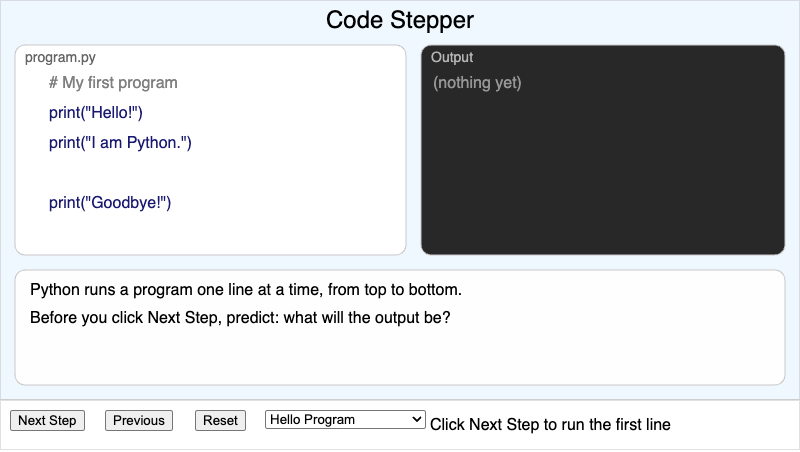

    Step through a short Python program one line at a time and watch the
    output appear — see top-to-bottom execution with your own eyes.
    (Chapters 1-2)

-   **[Variable Memory Model](./variable-memory-model/index.md)**

    ---

    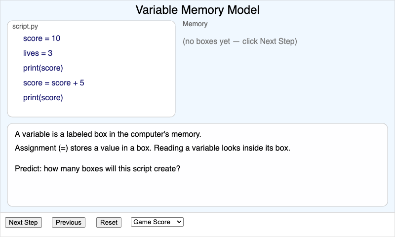

    Watch labeled memory boxes get created, read, and replaced as a script
    runs — the sticky-note metaphor made real. (Chapter 3)

-   **[Function Call Flow](./function-call-flow/index.md)**

    ---

    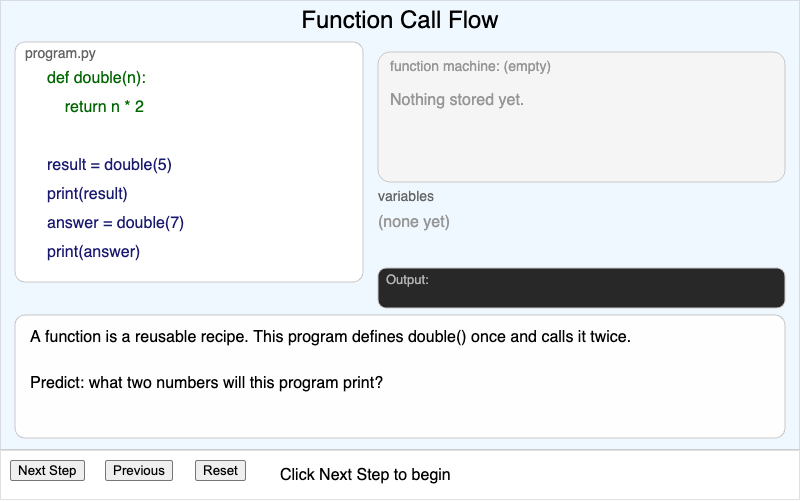

    Trace a function call in slow motion: the argument flies into the
    parameter slot and the return value flies back. (Chapter 4)

-   **[Turtle State Inspector](./turtle-state-inspector/index.md)**

    ---

    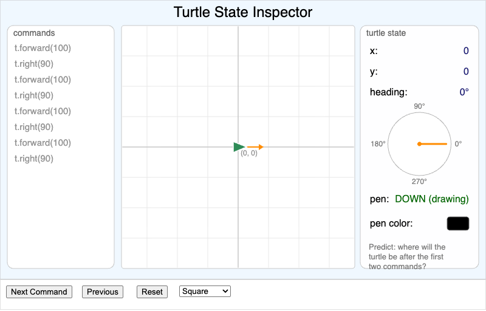

    Step through turtle commands while a dashboard reveals the turtle's
    hidden state: position, heading compass, and pen. (Chapter 5)

-   **[Expression Evaluator](./expression-evaluator/index.md)**

    ---

    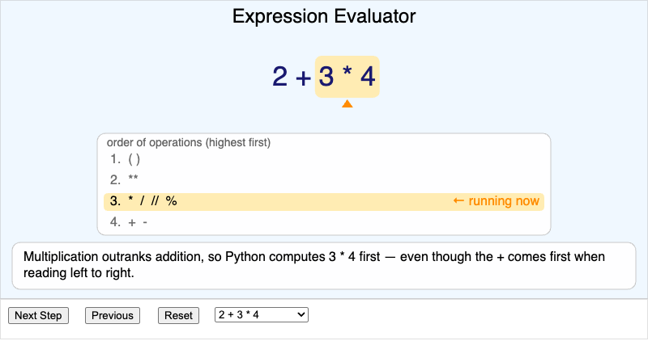

    Watch `2 + 3 * 4` collapse one operation at a time in the exact order
    Python evaluates it — PEMDAS made visible. (Chapter 6)

-   **[Modulo Clock](./modulo-clock/index.md)**

    ---

    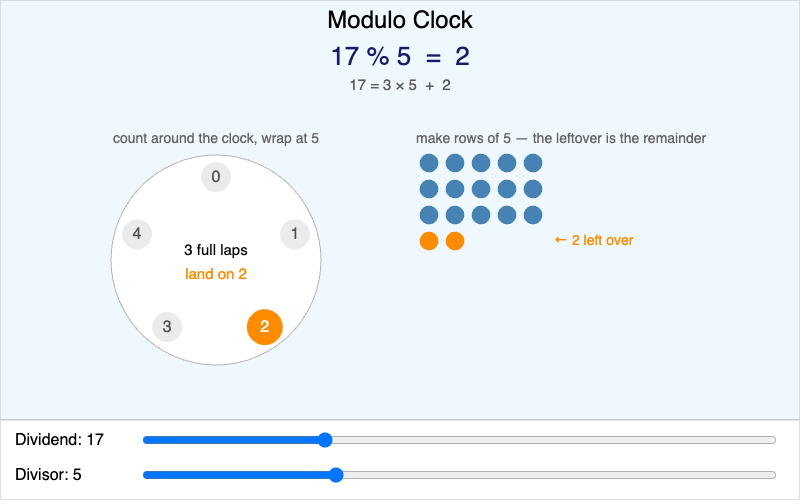

    See the remainder as wrap-around counting on a dial and as leftover
    dots — the `%` operator made concrete. (Chapter 6)

-   **[For-Loop Stepper](./for-loop-stepper/index.md)**

    ---

    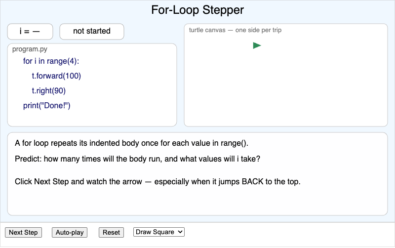

    Crank a for loop by hand: watch `i` change, the arrow jump back to the
    top, and a turtle draw one square side per trip. (Chapter 7)

-   **[Range Explorer](./range-explorer/index.md)**

    ---

    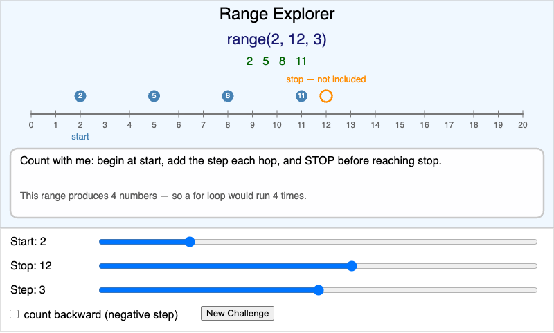

    Slide start, stop, and step and watch the number line light up — the
    stop value is a hollow ring because it is never included. (Chapter 7)

-   **[Control Flow Explorer](./control-flow-explorer/index.md)**

    ---

    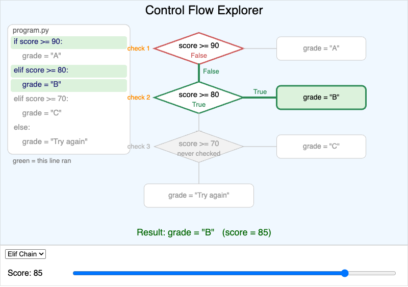

    Move a score slider and watch exactly one path through an if/elif/else
    flowchart glow green — later checks are never even looked at. (Chapter 9)

-   **[Boolean Logic Lab](./boolean-logic-lab/index.md)**

    ---

    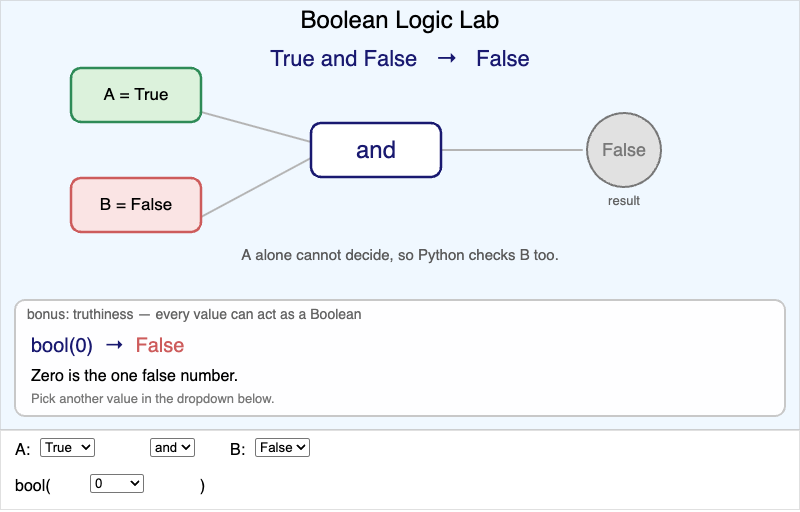

    Wire True/False inputs into and, or, and not — and catch Python
    skipping the second input when the first one decides. (Chapters 9, 19)

-   **[While-Loop Stepper](./while-loop-stepper/index.md)**

    ---

    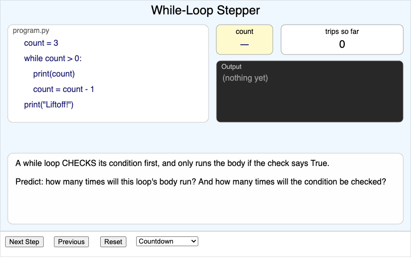

    Feel the check-run-check rhythm of a while loop — and safely watch an
    infinite loop spin inside its cage. (Chapter 10)

-   **[Scope Inspector](./scope-inspector/index.md)**

    ---

    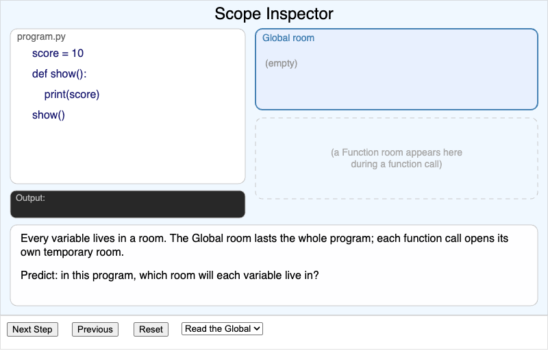

    Variables live in rooms: watch a Function room appear during a call,
    shadow the global, and vanish at return. (Chapter 11)

