# Turtle Graphics Gallery

Browse these examples to see what turtle graphics can do.
Each pattern is runnable in your browser — click the link to open the interactive lab.

-   **Rainbow Square Spiral**

    ---

    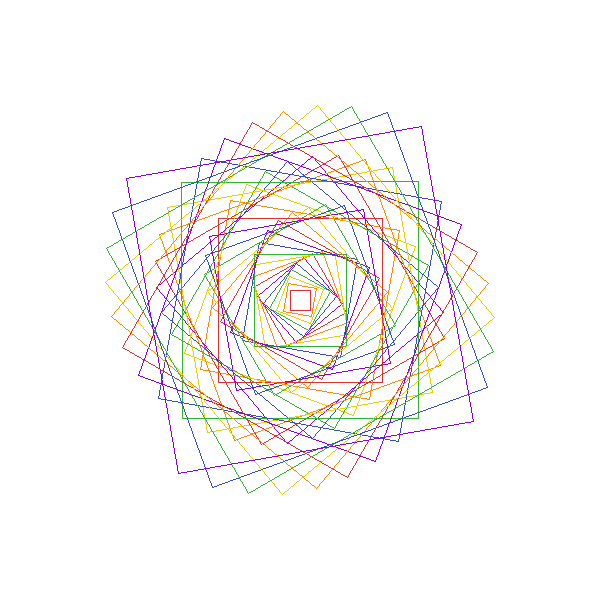

    Draw a square, rotate 10°, draw a larger square — repeat 36 times.
    Colors cycle through red, orange, yellow, green, blue, and violet.
    Teaches: `for` loops, color lists, and the modulo operator.

    [:octicons-arrow-right-24: Open Lab](./rainbow-square-spiral/index.md)

-   **Pinwheel of Triangles**

    ---

    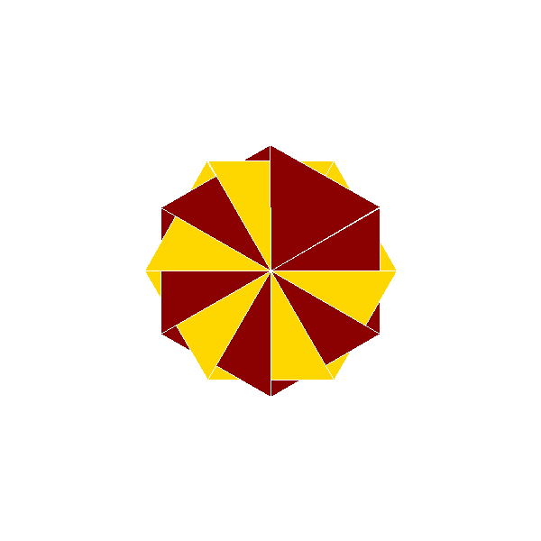

    Draw 12 equilateral triangles, each rotated 30° from the last.
    Gold and dark-red blades fan out from the center like a spinning wheel.
    Teaches: the `360 / n` rotation formula, `begin_fill()`, and radial symmetry.

    [:octicons-arrow-right-24: Open Lab](./pinwheel-of-triangles/index.md)

-   **Nested Circles**

    ---

    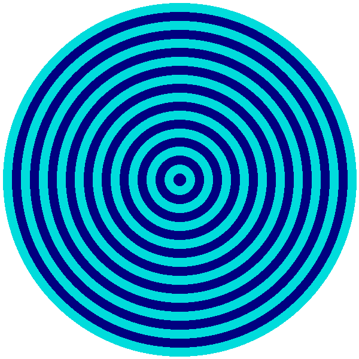

    Twenty concentric rings alternating cyan and navy pulse outward from the center.
    Teaches: `circle()`, `goto()` for centering, and why drawing order matters.

    [:octicons-arrow-right-24: Open Lab](./nested-circles/index.md)

-   **Starburst**

    ---

    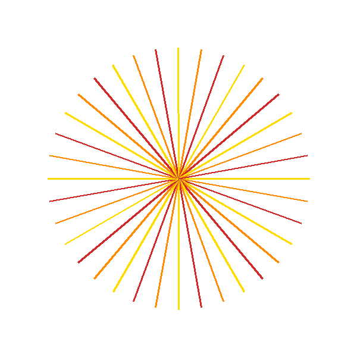

    Thirty-six spokes burst from the center, cycling yellow → orange → red.
    Teaches: forward + backward as a spoke, color cycling with modulo, and 360° math.

    [:octicons-arrow-right-24: Open Lab](./starburst/index.md)

-   **Checkerboard Grid**

    ---

    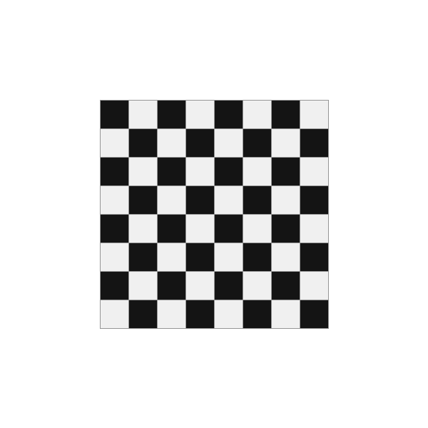

    An 8×8 chessboard built entirely from nested loops and coordinate arithmetic.
    Teaches: nested `for` loops, position formulas, and `(row + col) % 2` for alternation.

    [:octicons-arrow-right-24: Open Lab](./checkerboard-grid/index.md)

-   **Diagonal Stripe Field**

    ---

    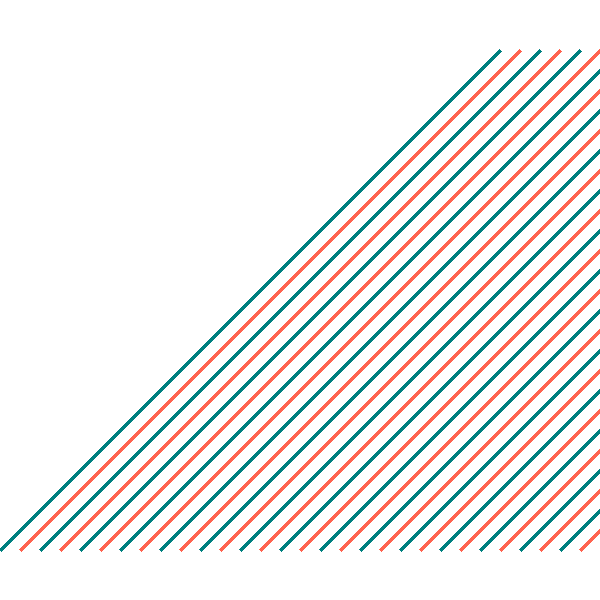

    Thirty parallel diagonal lines alternate teal and coral across the canvas.
    Teaches: `setheading()` for absolute angles, spacing stripes with a loop counter formula.

    [:octicons-arrow-right-24: Open Lab](./diagonal-stripe-field/index.md)

-   **Dotted Grid**

    ---

    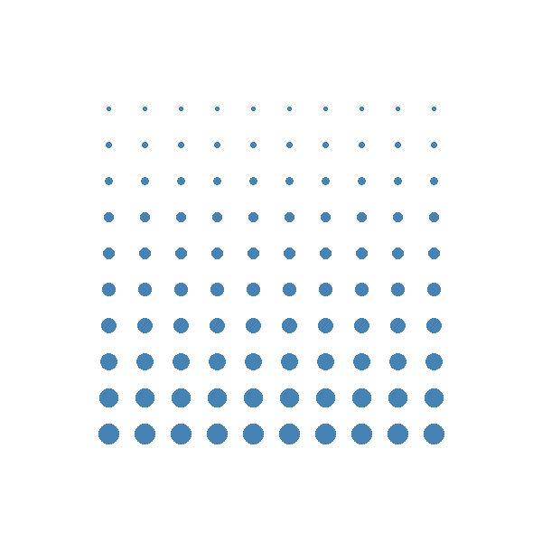

    A 10×10 grid of dots that grow larger toward the bottom, creating an illusion of depth.
    Teaches: `dot()`, nested loops, and mapping a loop variable to a visual property.

    [:octicons-arrow-right-24: Open Lab](./dotted-grid/index.md)

-   **Color Wheel Wedges**

    ---

    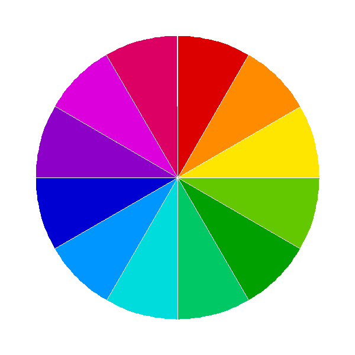

    Twelve pie-slice wedges fill the circle with every hue of the color wheel.
    Teaches: `360 / n` wedge angles, arc approximation, and iterating a color list.

    [:octicons-arrow-right-24: Open Lab](./color-wheel-wedges/index.md)

-   **Pentagon Chain**

    ---

    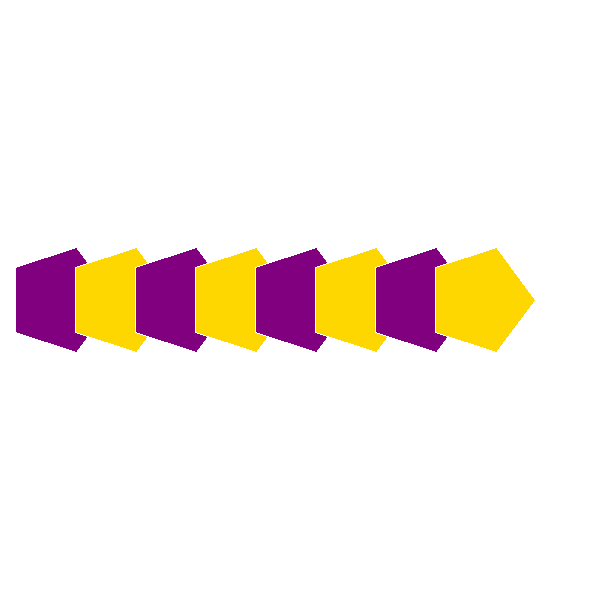

    Ten pentagons march in a row, alternating purple and gold, corner-to-corner.
    Teaches: the `360 / sides` exterior angle formula and chaining shapes horizontally.

    [:octicons-arrow-right-24: Open Lab](./pentagon-chain/index.md)

-   **Overlapping Squares**

    ---

    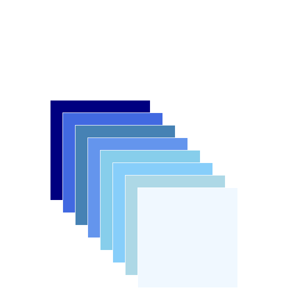

    Eight squares offset diagonally cascade from dark navy to near-white.
    Teaches: draw order, diagonal offset positioning, and color gradient planning.

    [:octicons-arrow-right-24: Open Lab](./overlapping-squares/index.md)

-   **Flower with Petal Function**

    ---

    

    Eight petals assembled by calling a `petal(size, color)` function in a loop.
    Teaches: defining and calling parameterized functions, arc-based petal geometry.

    [:octicons-arrow-right-24: Open Lab](./flower-petal-function/index.md)

-   **Honeycomb Grid**

    ---

    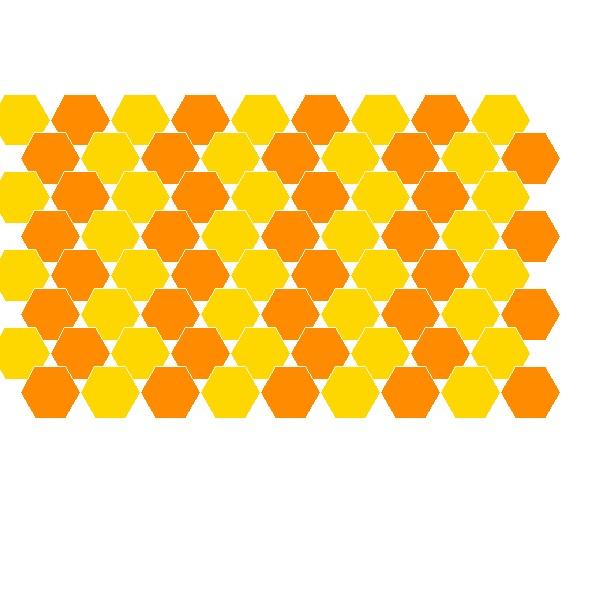

    Dozens of hexagons tile the canvas perfectly in gold and orange.
    Teaches: `hexagon()` functions, offset-row tiling math, and why hexagons tile perfectly.

    [:octicons-arrow-right-24: Open Lab](./honeycomb-grid/index.md)

-   **City Skyline**

    ---

    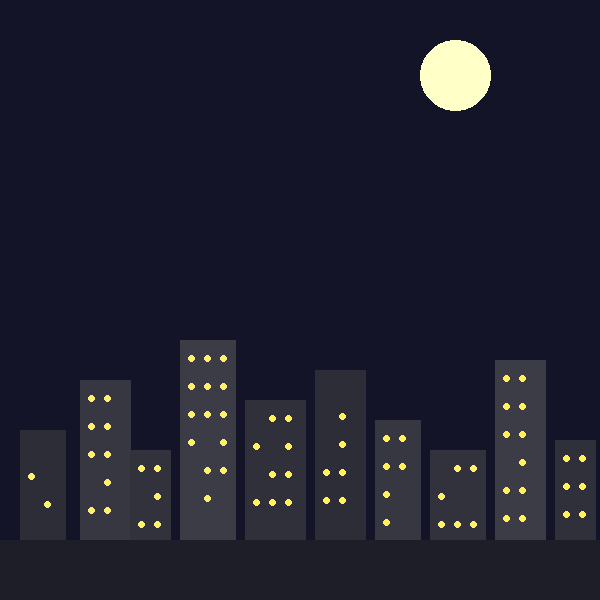

    Ten skyscrapers of varied heights fill a night skyline with glowing windows.
    Teaches: multi-parameter functions, composing a scene from repeated calls, nested loops.

    [:octicons-arrow-right-24: Open Lab](./city-skyline/index.md)

-   **Snowflake Arms**

    ---

    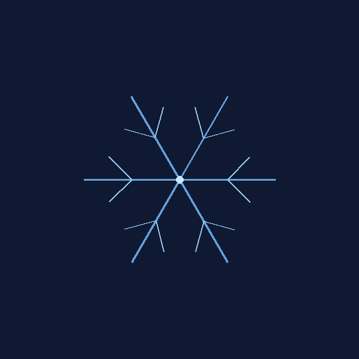

    Six identical arms with side twigs form a crystalline snowflake.
    Teaches: `arm()` function, returning turtle to its start state, six-fold symmetry.

    [:octicons-arrow-right-24: Open Lab](./snowflake-arms/index.md)

-   **Polka Dot Canvas**

    ---

    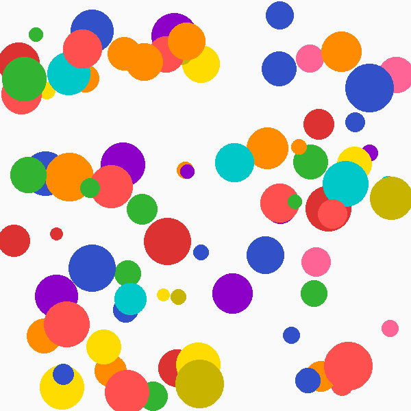

    Eighty colorful dots scattered at random sizes and positions across the canvas.
    Teaches: `random.randint()`, `random.choice()`, `random.seed()` for reproducibility.

    [:octicons-arrow-right-24: Open Lab](./polka-dot-canvas/index.md)

-   **Brick Wall**

    ---

    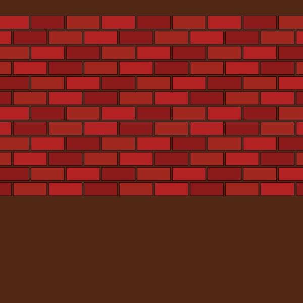

    Eight rows of staggered red-brown bricks with dark mortar lines.
    Teaches: `fillcolor`/`pencolor` separation, the offset-row tiling pattern, ternary expressions.

    [:octicons-arrow-right-24: Open Lab](./brick-wall/index.md)

-   **Stars of Different Sizes**

    ---

    

    Fifteen gold and red stars scattered across a dark background at random sizes.
    Teaches: the 144° star angle, four-parameter functions, and random scatter.

    [:octicons-arrow-right-24: Open Lab](./stars-different-sizes/index.md)

-   **Traffic Light Stack**

    ---

    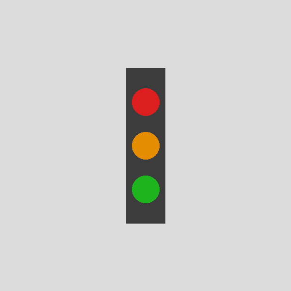

    A three-signal traffic light assembled from one rectangle and three dot calls.
    Teaches: decomposing real objects into primitives, layered draw order, positional parameters.

    [:octicons-arrow-right-24: Open Lab](./traffic-light/index.md)

-   **Fish School**

    ---

    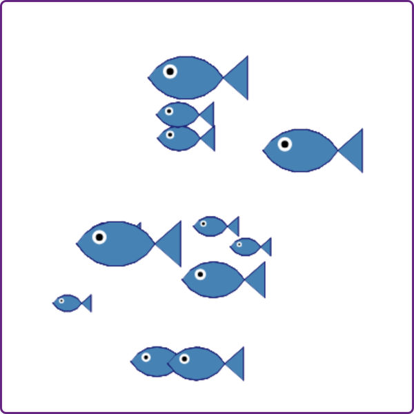

    Fifteen blue fish of varied sizes swim through a deep blue ocean.
    Teaches: building creature shapes from arc + triangle, parameter-driven variation.

    [:octicons-arrow-right-24: Open Lab](./fish-school/index.md)

-   **Mountain Range**

    ---

    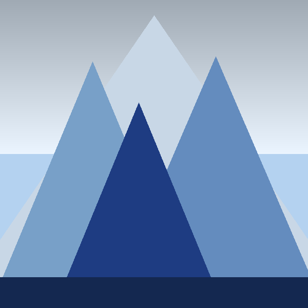

    Three layers of mountains recede into a pale sky using color value for depth.
    Teaches: back-to-front layering, `goto()` waypoints, atmospheric perspective with color.

    [:octicons-arrow-right-24: Open Lab](./mountain-range/index.md)

-   **Archimedean Square Spiral**

    ---

    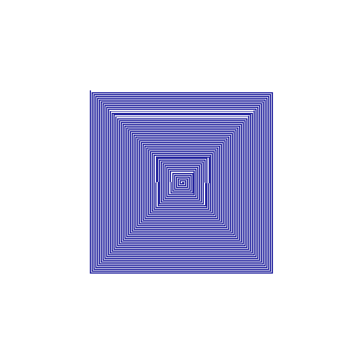

    A square spiral that grows outward using nothing but a fixed turn and a growing step.
    Teaches: how `step += n` creates a spiral, the effect of changing the turn angle.

    [:octicons-arrow-right-24: Open Lab](./archimedean-spiral/index.md)

-   **Rainbow Line Spiral**

    ---

    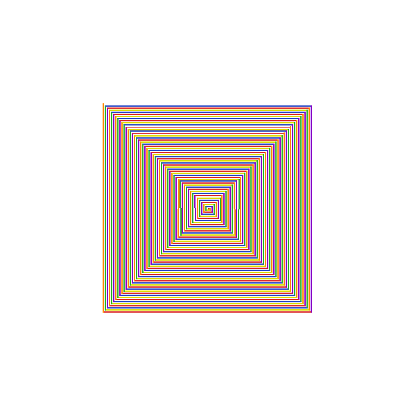

    The Archimedean spiral revisited — each segment colored by cycling six rainbow hues.
    Teaches: `i % len(colors)` for color cycling, how period mismatch creates diagonal banding.

    [:octicons-arrow-right-24: Open Lab](./rainbow-line-spiral/index.md)

-   **Spiral Text**

    ---

    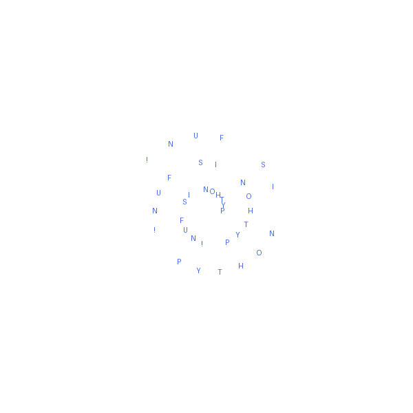

    Characters placed along a spiral using polar coordinates and `turtle.write()`.
    Teaches: `enumerate`, polar coordinates, `setheading`, text placement.

    [:octicons-arrow-right-24: Open Lab](./spiral-text/index.md)

-   **Seven-Segment Display**

    ---

    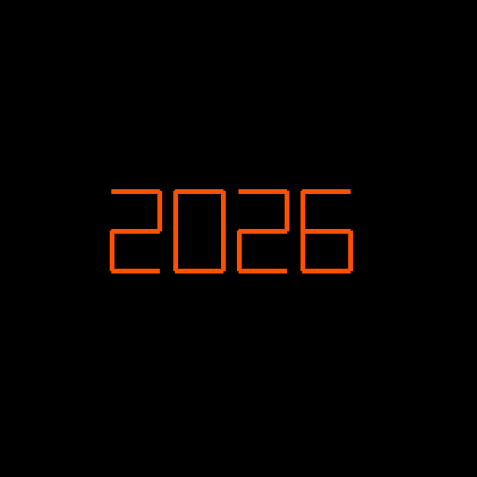

    Digits rendered from a dictionary of 7 on/off segment flags — like a digital clock.
    Teaches: dictionaries, bitmasks, conditional drawing, data-driven rendering.

    [:octicons-arrow-right-24: Open Lab](./seven-segment/index.md)

-   **Circular Name Badge**

    ---

    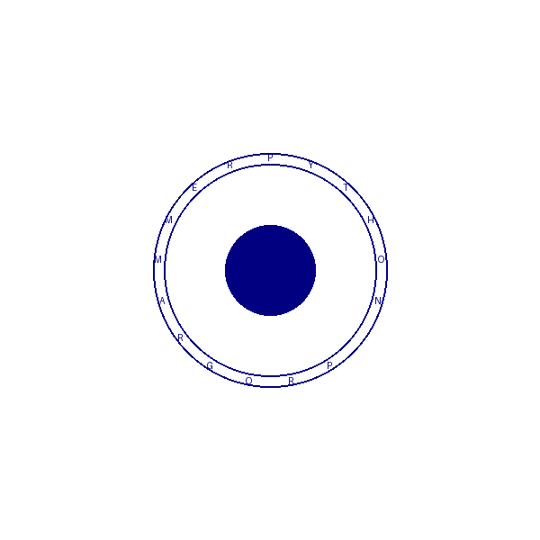

    Text arranged around a circle like a coin or official seal.
    Teaches: angular text placement, `setheading`, circular geometry, `write()`.

    [:octicons-arrow-right-24: Open Lab](./circular-badge/index.md)

-   **Name in Block Letters**

    ---

    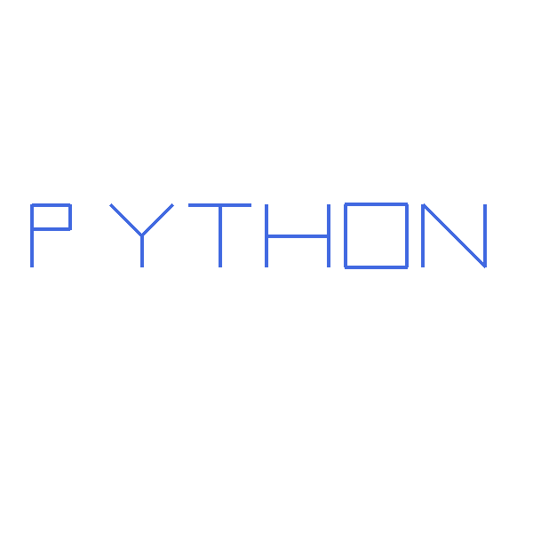

    Letters defined as stroke waypoints and rendered with `goto()` — a vector font.
    Teaches: dictionaries of coordinates, `goto()` rendering, font data structures.

    [:octicons-arrow-right-24: Open Lab](./block-letters/index.md)

-   **Rotating Squares Illusion**

    ---

    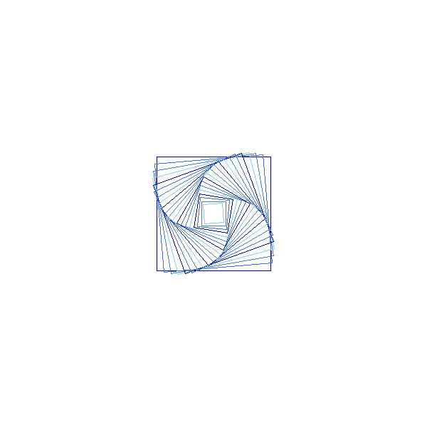

    Concentric squares each rotated 5° more — static geometry that appears to spin.
    Teaches: nested loops, angle offset, Op Art illusions, `sqrt(2)` geometry.

    [:octicons-arrow-right-24: Open Lab](./rotating-squares/index.md)

-   **Café Wall Illusion**

    ---

    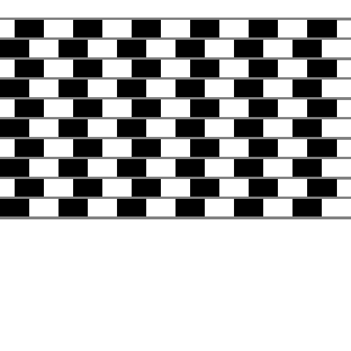

    Offset rows of black/white tiles make perfectly horizontal gray lines look slanted.
    Teaches: tile grids, row offset, filled rectangles, perception vs reality.

    [:octicons-arrow-right-24: Open Lab](./cafe-wall/index.md)

-   **Moiré Pattern**

    ---

    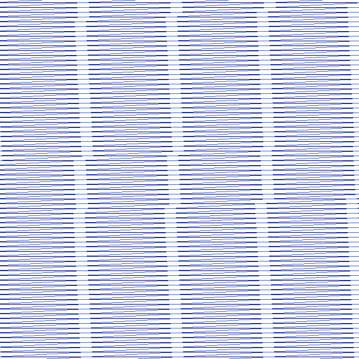

    Two sets of parallel lines at slightly different angles create beating interference.
    Teaches: line grids, angle rotation, Moiré period formula, parametric lines.

    [:octicons-arrow-right-24: Open Lab](./moire-pattern/index.md)

-   **Bridget Riley Waves**

    ---

    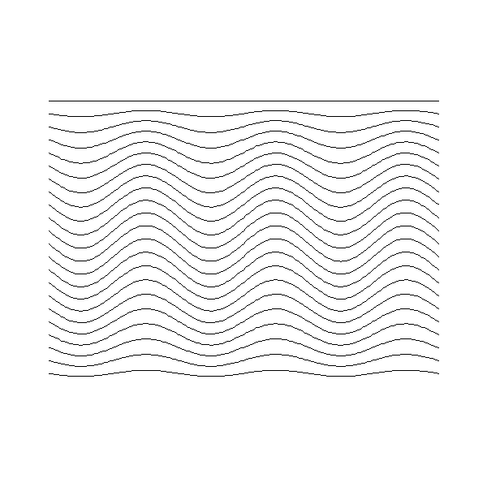

    Parallel sine curves with parabolic amplitude — static lines that appear to ripple.
    Teaches: sine waves, amplitude gradients, Op Art, `math.sin`.

    [:octicons-arrow-right-24: Open Lab](./riley-waves/index.md)

-   **Expanding Hexagons**

    ---

    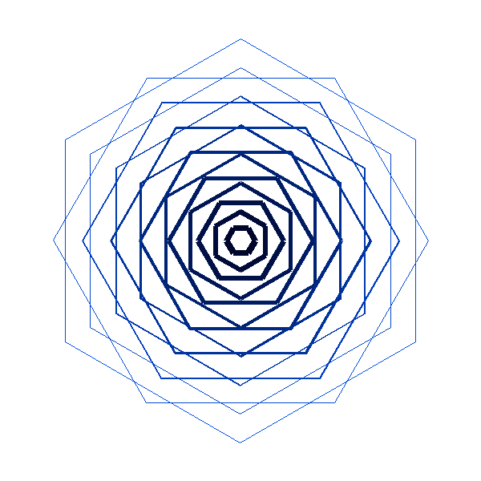

    Concentric hexagons alternating 0° and 30° with color gradient — hexagonal tunnel illusion.
    Teaches: hexagon geometry, rotation alternation, color gradients, depth illusions.

    [:octicons-arrow-right-24: Open Lab](./expanding-hexagons/index.md)

-   **Lissajous Figure**

    ---

    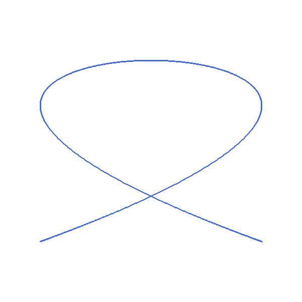

    `x=A*sin(a*t+δ), y=B*sin(b*t)` — frequency ratio controls loop count.
    Teaches: parametric equations, `math.sin`, oscilloscope math.

    [:octicons-arrow-right-24: Open Lab](./lissajous-figure/index.md)

-   **Rose Curve**

    ---

    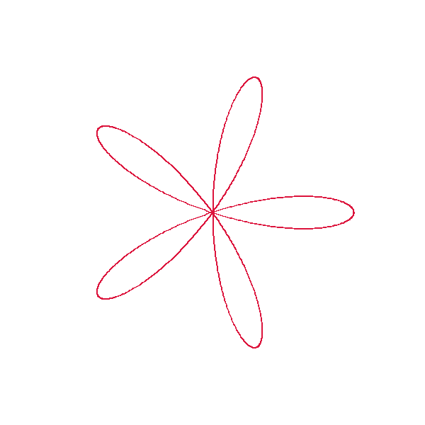

    `r = cos(k*theta)` in polar coordinates — odd k gives k petals, even k gives 2k.
    Teaches: polar equations, polar-to-Cartesian conversion, petal counting rules.

    [:octicons-arrow-right-24: Open Lab](./rose-curve/index.md)

-   **Spirograph**

    ---

    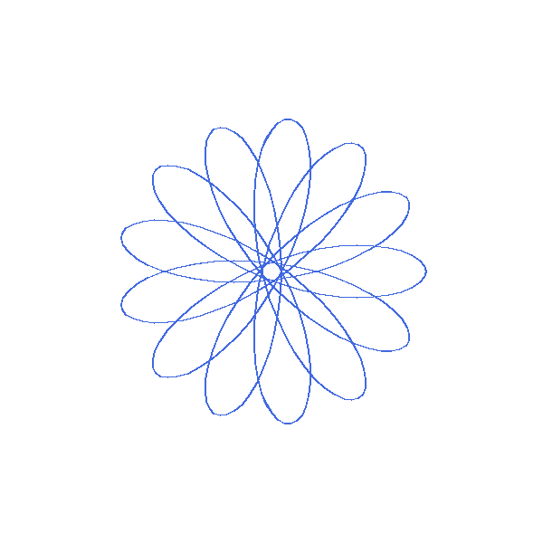

    Hypotrochoid: a point on a small circle rolling inside a larger one.
    Teaches: parametric equations, `R`, `r`, `d` parameters, closed curve conditions.

    [:octicons-arrow-right-24: Open Lab](./spirograph/index.md)

-   **Butterfly Curve**

    ---

    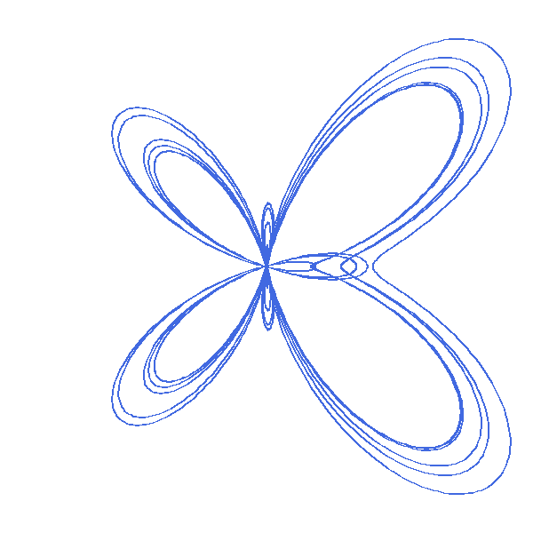

    `r = exp(cos t) - 2cos(4t) + sin⁵(t/12)` — complex shapes from one equation.
    Teaches: `math.exp`, combining trig terms, 12π periodic curves.

    [:octicons-arrow-right-24: Open Lab](./butterfly-curve/index.md)

-   **Epicycloid Star**

    ---

    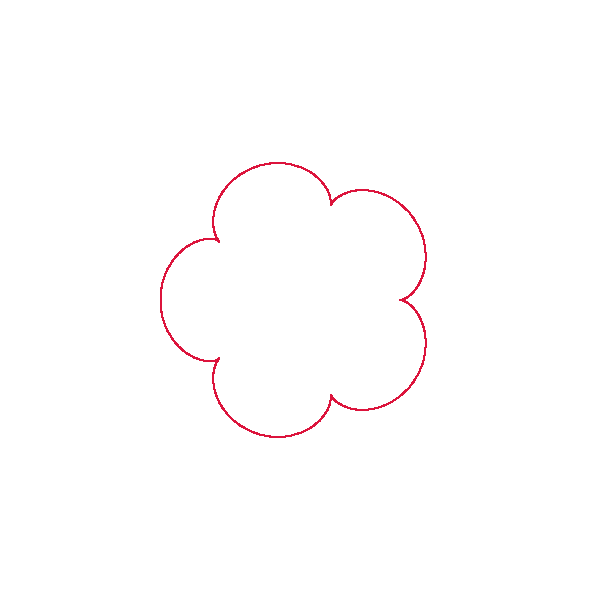

    Small circle rolling outside a large one — `R/r` integer gives that many cusps.
    Teaches: epicycloid parametric equations, cusp geometry, star construction.

    [:octicons-arrow-right-24: Open Lab](./epicycloid-star/index.md)

-   **Sunflower Seed Spiral**

    ---

    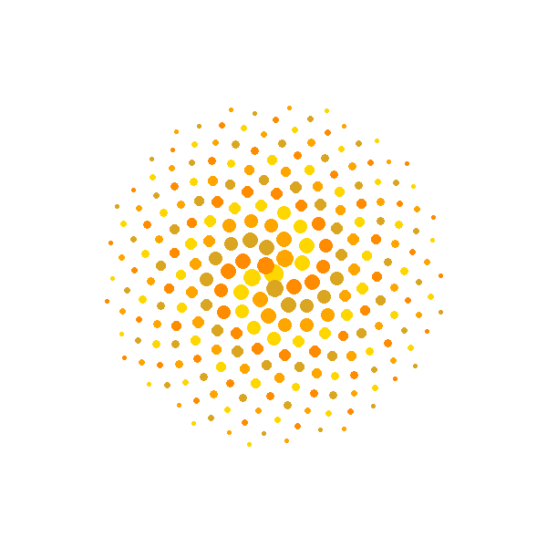

    Golden angle (137.5°) places dots like seeds in a real sunflower head.
    Teaches: polar coordinates, `math.sqrt`, `math.exp`, and Fibonacci packing.

    [:octicons-arrow-right-24: Open Lab](./sunflower-spiral/index.md)

-   **Spider Web**

    ---

    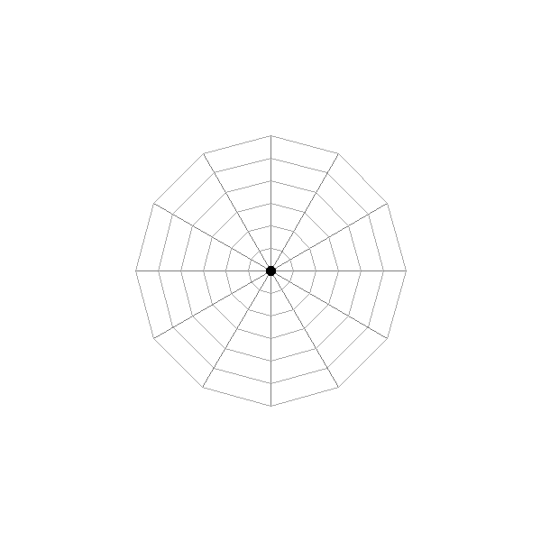

    12 radial spokes and 6 concentric rings drawn with polar coordinates and `goto()`.
    Teaches: radial + ring geometry, polar-to-Cartesian conversion, nested loops.

    [:octicons-arrow-right-24: Open Lab](./spider-web/index.md)

-   **Lightning Bolt**

    ---

    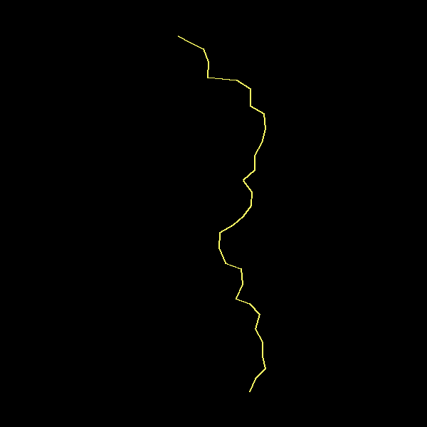

    Recursive midpoint displacement turns a straight line into a jagged bolt.
    Teaches: recursion, perpendicular vectors, Gaussian randomness.

    [:octicons-arrow-right-24: Open Lab](./lightning-bolt/index.md)

-   **Galaxy Spiral Arms**

    ---

    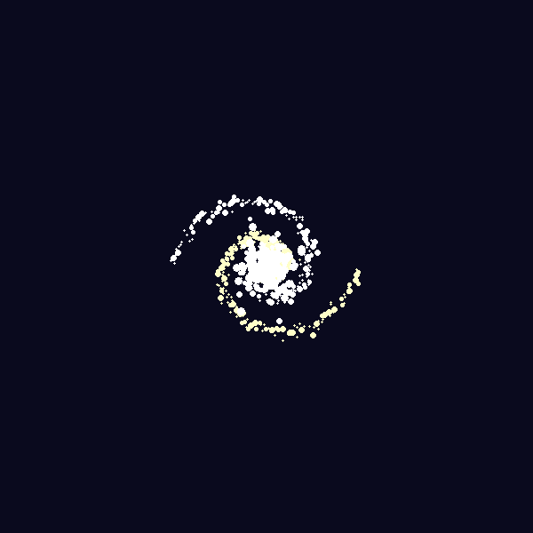

    Two logarithmic spiral arms with Gaussian scatter simulate the Milky Way.
    Teaches: `math.exp`, Gaussian scatter with `random.gauss`, dot placement.

    [:octicons-arrow-right-24: Open Lab](./galaxy-spiral/index.md)

-   **Ripple Waves**

    ---

    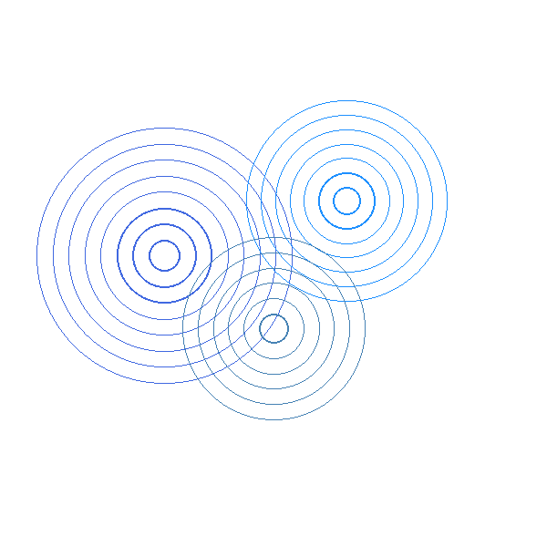

    Three sets of concentric rings from different centers create water-ripple interference.
    Teaches: functions with parameters, `circle()`, pensize for wave strength.

    [:octicons-arrow-right-24: Open Lab](./ripple-waves/index.md)

-   **Four-Fold Symmetric Doodle**

    ---

    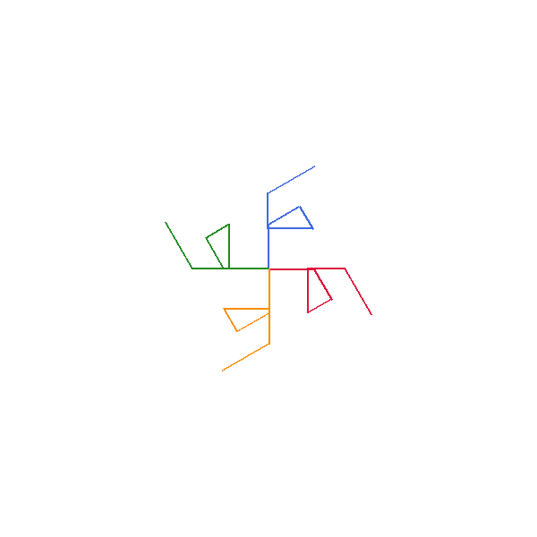

    Record turtle moves as data, replay them rotated 90°, 180°, 270° — instant symmetry.
    Teaches: commands as data, replay with transformation, four-fold rotation.

    [:octicons-arrow-right-24: Open Lab](./four-fold-doodle/index.md)

-   **Six-Fold Mandala**

    ---

    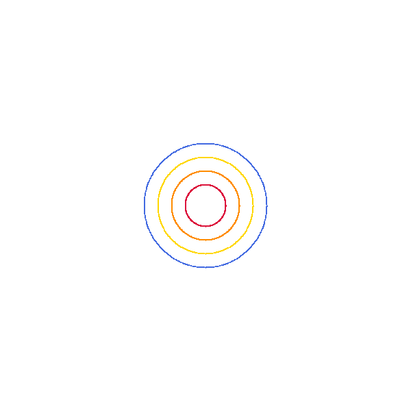

    One mandala section drawn and rotated 60° six times to create a full mandala.
    Teaches: `360/6 = 60°`, petal arcs with `circle()`, radial composition.

    [:octicons-arrow-right-24: Open Lab](./six-fold-mandala/index.md)

-   **Mirror Butterfly**

    ---

    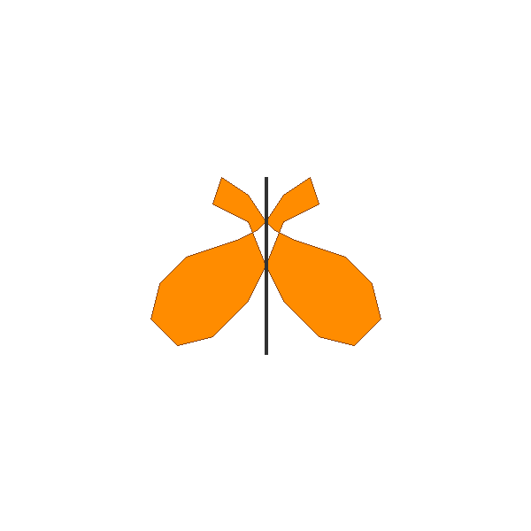

    Right wing drawn from waypoints, left wing mirrored by negating x-coordinates.
    Teaches: `(-x, y)` reflection, list comprehension for coordinate transforms.

    [:octicons-arrow-right-24: Open Lab](./mirror-butterfly/index.md)

-   **Truchet Tiles**

    ---

    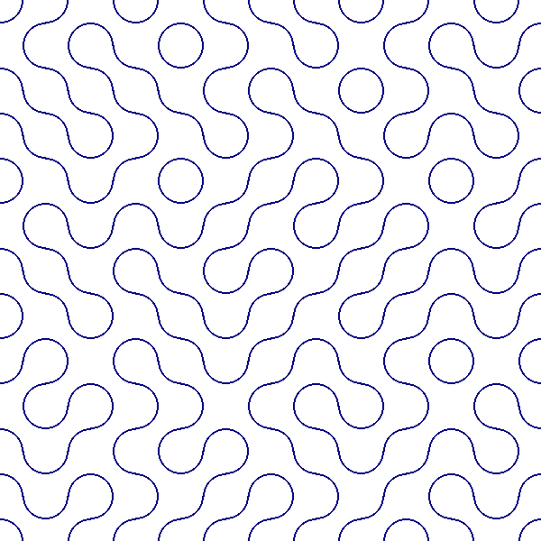

    Random arc tiles that form continuous winding paths through local random choices.
    Teaches: emergence, `random.choice`, and how local rules create global structure.

    [:octicons-arrow-right-24: Open Lab](./truchet-tiles/index.md)

-   **Islamic Geometric Star**

    ---

    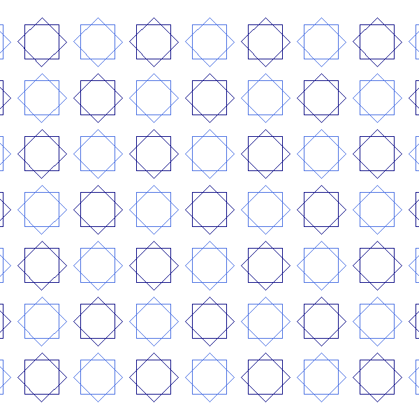

    8-pointed stars tiled in a grid — two overlapping squares rotated 45° from each other.
    Teaches: exact geometric construction, grid tiling, checkerboard color alternation.

    [:octicons-arrow-right-24: Open Lab](./islamic-star/index.md)

-   **Mandelbrot Pixel Art**

    ---

    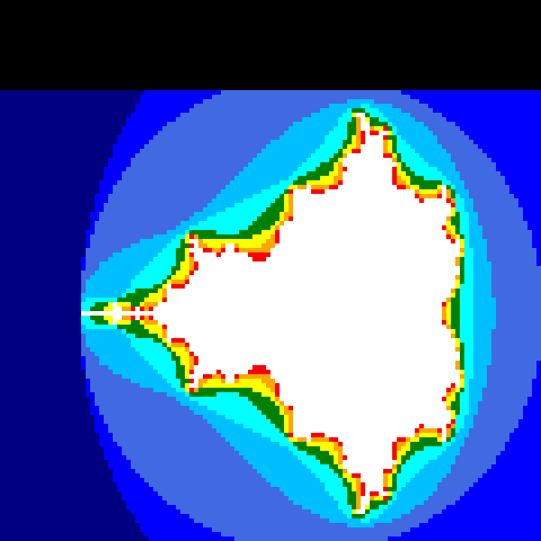

    Pixel-art Mandelbrot set colored by escape time using `dot()` on a grid.
    Teaches: complex number iteration, escape-time coloring, raster graphics.

    [:octicons-arrow-right-24: Open Lab](./mandelbrot-pixel-art/index.md)

-   **Julia Set Pixel Art**

    ---

    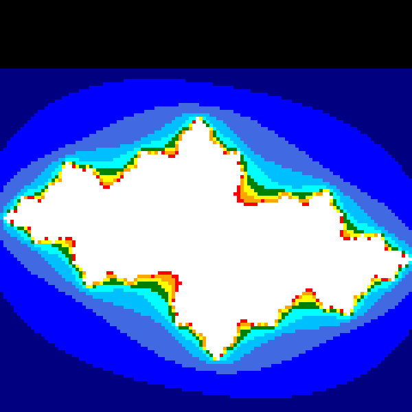

    The Mandelbrot's cousin — same iteration, fixed `c`, different starting `z` per pixel.
    Teaches: IFS concepts, how swapping z and c gives infinite fractal variety.

    [:octicons-arrow-right-24: Open Lab](./julia-set/index.md)

-   **Sierpiński Carpet**

    ---

    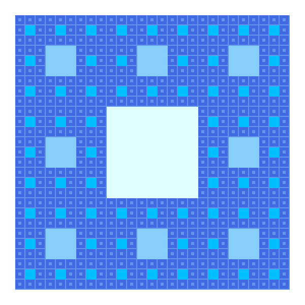

    9-subdivision of a square with the center removed, recursed 4 levels deep.
    Teaches: 8-way recursion, `(8/9)^n` area shrinkage, center-hole removal.

    [:octicons-arrow-right-24: Open Lab](./sierpinski-carpet/index.md)

-   **Barnsley Fern**

    ---

    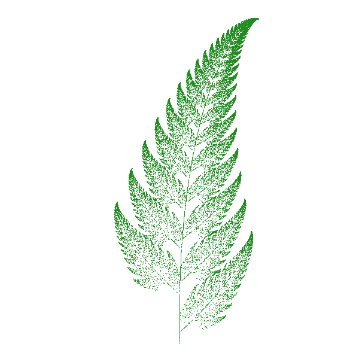

    A photorealistic fern leaf from 5000 random-transformation dot placements.
    Teaches: Iterated Function Systems, probability-weighted choice, scatter plots.

    [:octicons-arrow-right-24: Open Lab](./barnsley-fern/index.md)

-   **Anti-Koch Snowflake**

    ---

    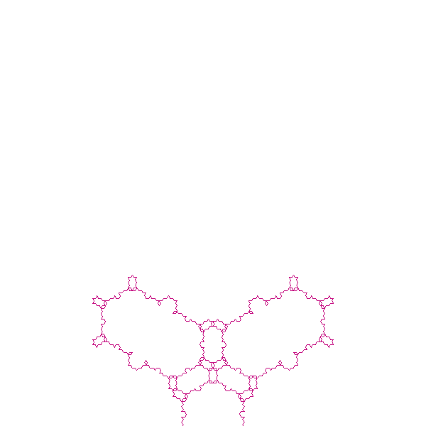

    Koch snowflake variant where bumps alternate inward and outward at each depth level.
    Teaches: rule alternation, sign changes in recursive turn angles.

    [:octicons-arrow-right-24: Open Lab](./anti-koch/index.md)

-   **Pythagorean Tree**

    ---

    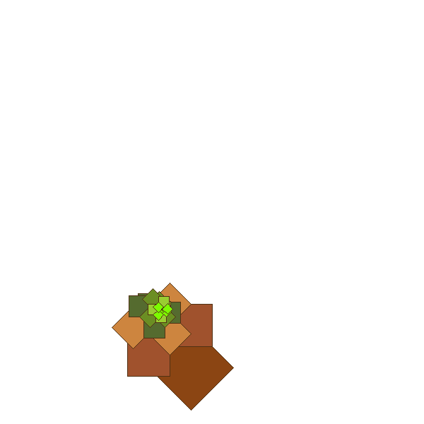

    Squares growing from squares — the Pythagorean theorem made visible as a fractal.
    Teaches: geometric recursion, depth-driven color, `a² + b² = c²` visually.

    [:octicons-arrow-right-24: Open Lab](./pythagorean-tree/index.md)

-   **T-Square Fractal**

    ---

    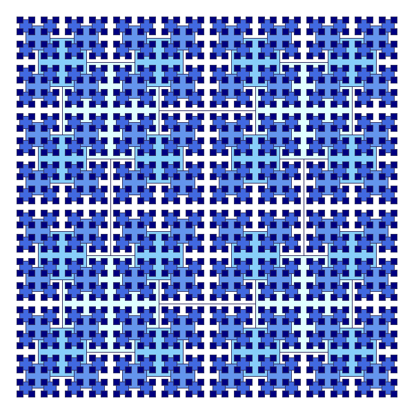

    A central square sprouts four half-sized squares at each corner, five levels deep.
    Teaches: quaternary recursion, 4-ary recursion, layered draw order.

    [:octicons-arrow-right-24: Open Lab](./t-square-fractal/index.md)

-   **Lévy C Curve**

    ---

    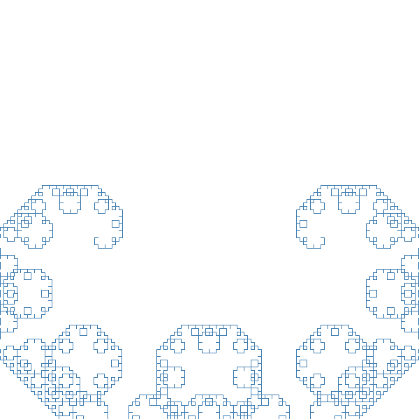

    A Koch-style fractal with 45° bumps that packs into a wing-like shape.
    Teaches: comparing fractal rules, `n / √2` segment sizing, plane-tiling curves.

    [:octicons-arrow-right-24: Open Lab](./levy-c-curve/index.md)

-   **Gosper Curve**

    ---

    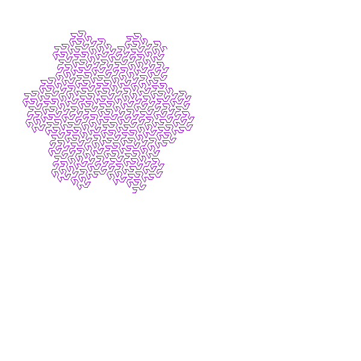

    The "flowsnake" — an L-system fractal that tiles hexagonal space.
    Teaches: string rewriting, L-systems, translating characters to turtle commands.

    [:octicons-arrow-right-24: Open Lab](./gosper-curve/index.md)

-   **Dragon Curve**

    ---

    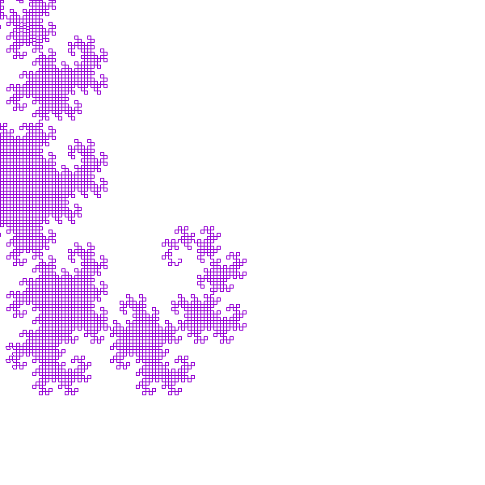

    The Heighway Dragon — a self-avoiding fractal built by simulating paper folding with a list.
    Teaches: list manipulation for fractals, L/R turn encoding, never-crossing paths.

    [:octicons-arrow-right-24: Open Lab](./dragon-curve/index.md)

-   **Hilbert Curve**

    ---

    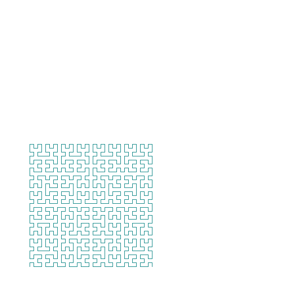

    A space-filling curve that visits every cell in a grid without crossing itself.
    Teaches: mutual recursion, `4^n` cells at depth `n`, and space-filling geometry.

    [:octicons-arrow-right-24: Open Lab](./hilbert-curve/index.md)

-   **Cantor Dust**

    ---

    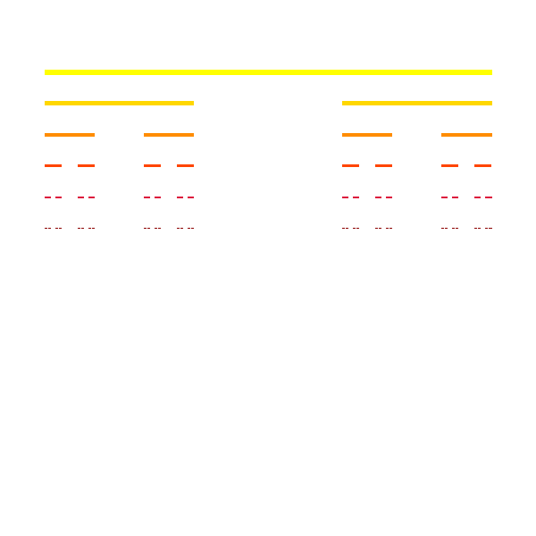

    Six rows of lines, each removing the middle third — infinite points, zero total length.
    Teaches: binary recursion, the `(2/3)^n` shrinking ratio, Cantor's paradox.

    [:octicons-arrow-right-24: Open Lab](./cantor-dust/index.md)

-   **Fractal Tree**

    ---

    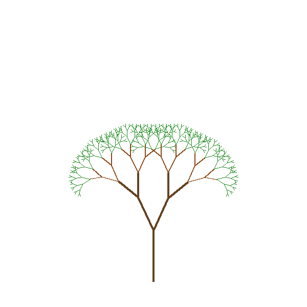

    A binary recursive tree with a thick brown trunk fading to green leaf tips.
    Teaches: binary recursion, `backward()` to return to fork points, depth-driven styling.

    [:octicons-arrow-right-24: Open Lab](./fractal-tree/index.md)

-   **Sierpiński Triangle**

    ---

    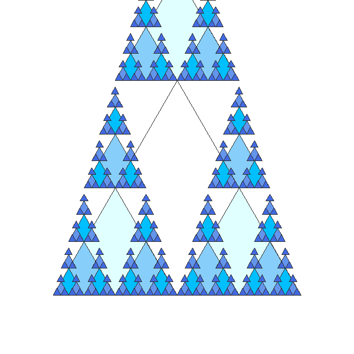

    A triangle made of triangles made of triangles — the iconic self-similar fractal.
    Teaches: ternary recursion, base cases, and how depth controls fractal detail.

    [:octicons-arrow-right-24: Open Lab](./sierpinski-triangle/index.md)

-   **Koch Snowflake**

    ---

    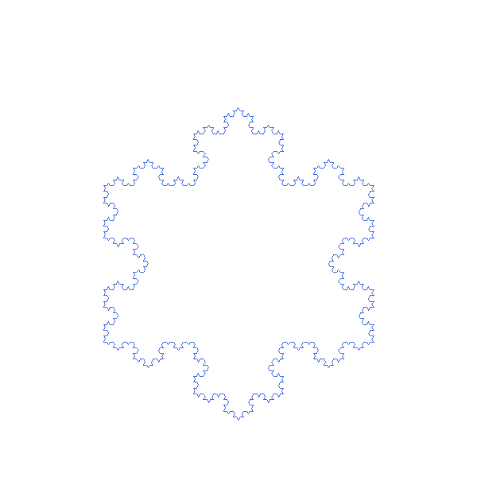

    A classic fractal snowflake built by recursively bumping every line segment outward.
    Teaches: recursion, base cases, and how one rule repeated creates infinite complexity.

    [:octicons-arrow-right-24: Open Lab](./koch-snowflake/index.md)

-   **Color-Banded Pentagon Spiral**

    ---

    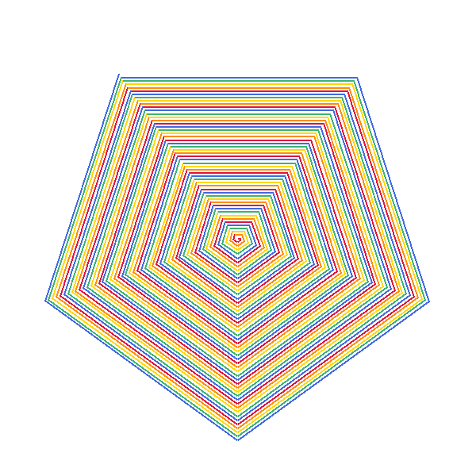

    A five-sided spiral colored in bands that align — or cut diagonally — across the arms.
    Teaches: `right(72)`, `i // n` banding, and how period mismatch creates diagonal stripes.

    [:octicons-arrow-right-24: Open Lab](./pentagon-spiral/index.md)

-   **Spiral of Spirals**

    ---

    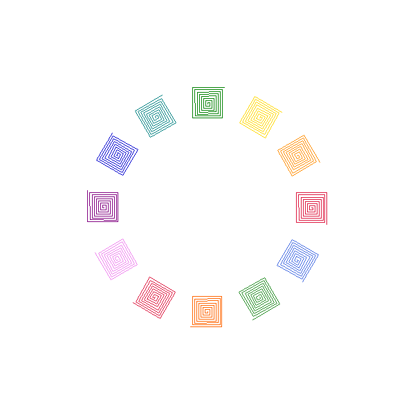

    Twelve small square spirals arranged in a ring, each facing outward from the center.
    Teaches: reusable functions, `cos`/`sin` placement, and pattern-of-patterns composition.

    [:octicons-arrow-right-24: Open Lab](./spiral-of-spirals/index.md)

-   **Fibonacci Spiral**

    ---

    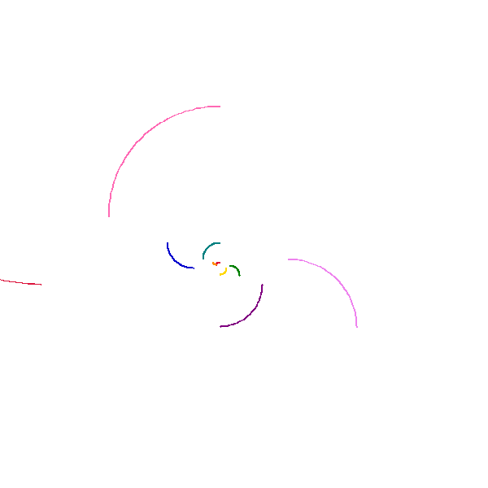

    Ten colored quarter-circle arcs — radii 1, 1, 2, 3, 5, 8, 13, 21, 34, 55 — tile perfectly.
    Teaches: the Fibonacci sequence, `a, b = b, a + b`, and the golden ratio.

    [:octicons-arrow-right-24: Open Lab](./fibonacci-spiral/index.md)

-   **Double Helix Spiral**

    ---

    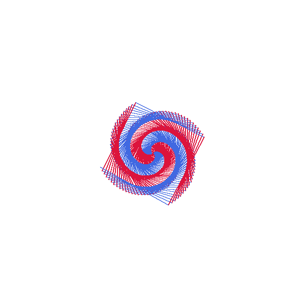

    Two interleaved spirals — red and blue — winding outward together from one loop.
    Teaches: `i % 2` alternation, phase offset, and how one loop draws two patterns.

    [:octicons-arrow-right-24: Open Lab](./double-helix-spiral/index.md)

-   **Colored Logarithmic Spiral**

    ---

    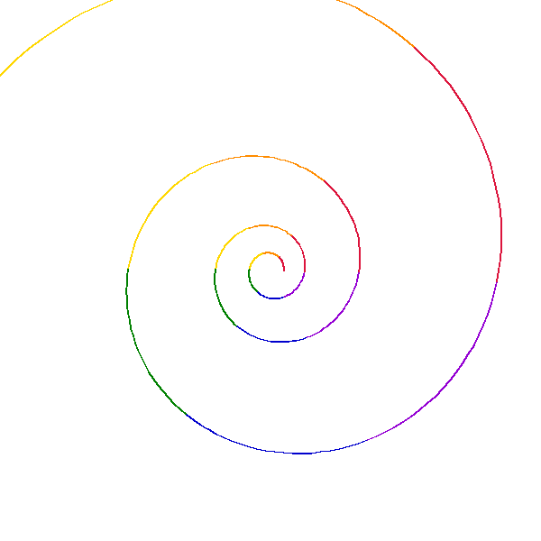

    A smooth, continuously curved spiral colored by angle — built with `cos()` and `sin()`.
    Teaches: polar-to-Cartesian conversion, `math.exp()`, and `goto()` for smooth curves.

    [:octicons-arrow-right-24: Open Lab](./logarithmic-spiral/index.md)

-   **Inward Collapsing Spiral**

    ---

    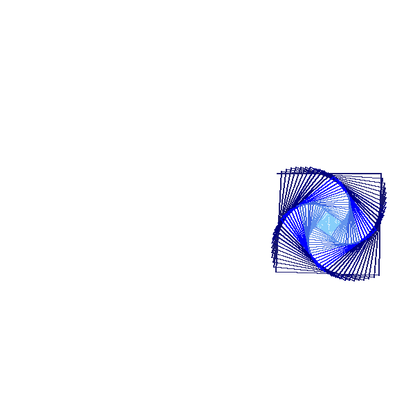

    A spiral that starts large and converges to a point, fading from deep blue to white.
    Teaches: decreasing sequences, `while` loops, and visual convergence.

    [:octicons-arrow-right-24: Open Lab](./inward-spiral/index.md)

-   **Triangular Spiral**

    ---

    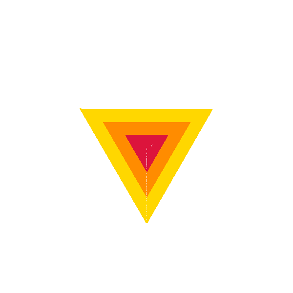

    A warm red-orange-gold spiral with sharp 120° triangular corners.
    Teaches: `i // n` for color bands vs `i % n` for segment cycling.

    [:octicons-arrow-right-24: Open Lab](./triangular-spiral/index.md)

-   **Hexagonal Spiral**

    ---

    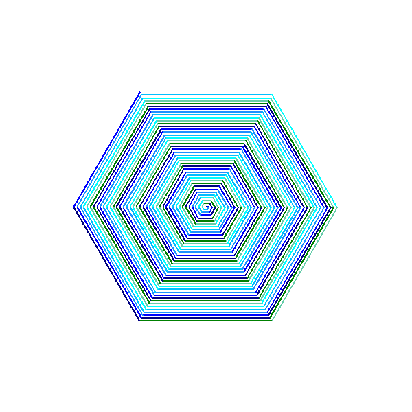

    A blue-to-green spiral with hexagonal corners — one number change from the square spiral.
    Teaches: how the turn angle alone determines a spiral's polygon shape.

    [:octicons-arrow-right-24: Open Lab](./hexagonal-spiral/index.md)

